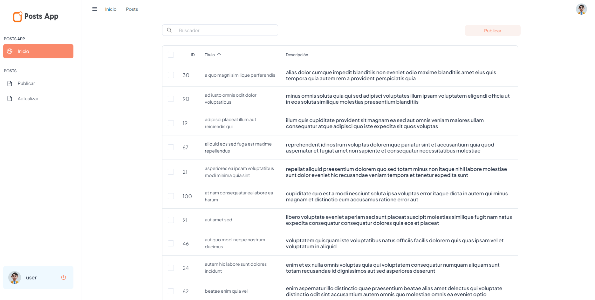
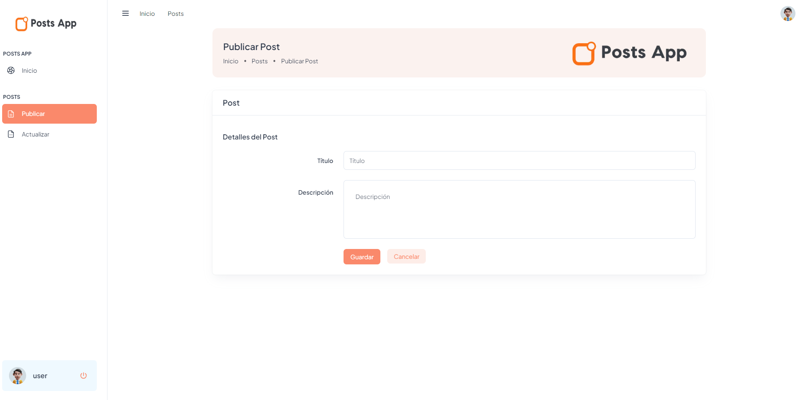

# [POSTS APP](https://posts-app-sigma.vercel.app/) (Prueba Técnica)

El objetivo de este proyecto es desarrollar una aplicación web con los siguientes requerimientos:

- Al iniciar listé los posts paginados en un data table
- Cada post debe tener el botón de eliminar
- Se deben crear los formularios respectivos para publicar y actualizar un Post
- Mostrar una ventana (modal) de notificación para cualquiera de las operaciones realizadas.

## Primeros pasos

Estas instrucciones te ayudarán a obtener una copia del proyecto en funcionamiento en tu máquina local para desarrollo y pruebas. Consulta la sección de "Despliegue" para obtener notas sobre cómo implementar el proyecto en un sistema en vivo.

### Prerrequisitos

Servicios que necesitas instalar y cómo hacerlo.

- [Node.js](https://nodejs.org/docs/latest/api/)
- [DockerDesktop](https://www.docker.com/products/docker-desktop/)

### Instalación

Sigue estos pasos para configurar tu entorno de desarrollo:

1. Clona el repositorio:

   ```bash
   https://github.com/juan-bazurto-eci/posts-app.git
   ```

2. Navega al directorio del proyecto

   ```
   cd posts-app
   ```

3. Hacemos la construccion del proyecto

   ```
   npm install
   ```

## Despliegue

Ejecutamos los siguientes comandos

    # para ejecutar en modo dev
    npm run dev

    # para ejecutar en qa o producción env. Espera ejecutar esto en docker
    npm run start

Accedemos a la siguiente URL

     https://localhost:3000/

Para acceder al dashboard el usuario y contraseña son

    # Email
    user@post.co
    # Contraseña
    user123

## Ejecución de las pruebas

Con el siguiete comando podras ejecutar las pruebas unitarias

    npm run test

El siguiente es el coverage de las pruebas

    npm run coverage


## Diseño de la aplicación

En realidad, todas las páginas de un mismo proyecto comparten la misma estructura. Hago buen uso de algunas características de Nextjs y algunos componentes personalizados para organizar las páginas:

### pages/dashboard.tsx

Esta página es en la cual sé enlistan los posts y la primera página a la que entra el usuario cuando se loggea, en el buscador podremos filtrar los posts por título y el botón de publicar nos llevara la página para publicar un post.



### pages/posts/publicar.tsx

Esta página es en la cual el usuario podrá publicar nuevos posts, tendrá que llenar el formulario y guardar el post. Los posts luego de publicados se podrán visualizar en el dashboard.



### pages/posts/actualizar.tsx

Esta página es en la cual el usuario podrá actualizar los posts, primero el usuario tiene que buscar el ID del post que quiere actualizar, luego tendrá que llenar o hacer cambios en el formulario y guardar el post. Los posts luego de actualizados se podrán visualizar en el dashboard.


#### pages/\_document.tsx

Esto es proporcionado por el framework Nextjs. Define el esqueleto raíz de cualquier página. Por ejemplo, contiene marcas como `<html>`, `<head>`, `<body>`.

#### components/templates/FullLayout.tsx

Este es un componente personalizado, que es más acerca de la apariencia de la estructura de cualquier página. Para una página web típica, normalmente necesitamos definir la cabecera, el pie de página y dónde mostrar el contenido principal.

#### Página individual

Aquí es donde definimos el contenido real de la página. Una página necesita incluir el componente Layout, este describe el aspecto de la página.

Así es como se ve en el método de renderizado de una página:

```js
render() {
  return (
    <Layout>
      <p>Hello World</p>
    </Layout>,
  );
}
```

### 💡 La página de error personalizada

Nextjs nos permite definir nuestra propia página de error. La página de error personalizada se encuentra en [/pages/404.tsx](https://github.com/juan-bazurto-eci/posts-app/blob/main/src/pages/404.tsx). Su aspecto es muy similar al de las páginas normales.

## Despliegue

### 💡 Uso de Docker para la estrategia de despliegue

Se crea un dockerfile, para el despliegue en local de la aplicación

#### Archivos relacionados

- [Dockerfile](https://github.com/juan-bazurto-eci/posts-app/blob/main/Dockerfile)
- [.dockerignore](https://github.com/juan-bazurto-eci/posts-app/blob/main/.dockerignore)

### 💡 Uso de Vercel para despliegue en web

Se crea un projecto y se configura en Vercel para el despliegue de la aplicación.

- [Posts App Web](https://posts-app-sigma.vercel.app/)

## Construido con

- [Node.js](https://nodejs.org/)
- [Typescript](https://www.typescriptlang.org/) - Lenguaje de programación principal
- [npm.js](https://www.npmjs.com/) - Gestión de dependencias y construcción del proyecto
- Git - Control de versiones
- HTML, JavaScript - Interfaz de usuario
- [React](https://es.react.dev/) - Interfaz de usuario
- [Next.js](https://nextjs.org/) - Interfaz de usuario
- [Vercel](https://vercel.com/) - Despliegue

## Autor

- **Juan Camilo Bazurto** - [Linkedin](https://www.linkedin.com/in/juan-camilo-b-b65379105/) - [GitHub](https://github.com/juan-bazurto-eci)
